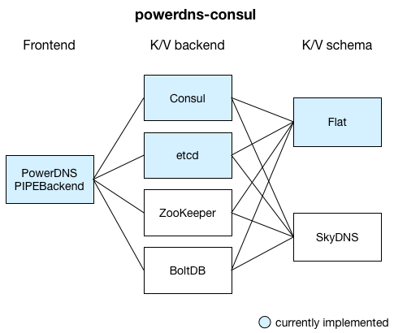

# powerdns-consul

powerdns-consul is a utility written in [Go](https://golang.org) that allows you
to use the [Consul](https://consul.io) key value store as a backend for
[PowerDNS](https://www.powerdns.com) through the [Pipe backend](https://doc.powerdns.com/md/authoritative/backend-pipe/).

Some of the PowerDNS-related code is inspired by [mindreframer's work](https://github.com/mindreframer/golang-stuff/blob/master/github.com/youtube/vitess/go/cmd/zkns2pdns/pdns.go).

## Usage

1. Customize the `powerdns-consul.json.example` configuration
2. Execute `./powerdns-consul -config=/path/to/powerdns-consul.json`
  - Set `DEBUG=1` to make powerdns-consul print each request and response

## Architecture

powerdns-consul implements the [PowerDNS pipe backend](https://doc.powerdns.com/md/authoritative/backend-pipe/) protocol.
It can use various key-value stores to query for DNS records. Supported key-value store *backends* are:

- [Consul](https://consul.io) (tested against v0.7.0)
- [etcd](https://coreos.com/etcd/) (tested against v3.0.14)

You can organize the data in the key-value store in two different ways (*schemas*):

- **Flat** schema ([docs](docs/schema/flat.md))
- **SkyDNS** schema ([docs](https://github.com/skynetservices/skydns#service-announcements), this will be implemented in a future version)

## Building

- Clone the repository in your `$GOPATH/src/github.com/Shark/powerdns-consul`
- Run `go get ./...`
- Run `make`

## Testing

- Go tests: run `make test`
- End to end test
  - Run `make end2end_test`.
  - Requires a working [Docker](https://www.docker.com) setup.
  - This test will build powerdns-consul and a Docker image with PowerDNS, Consul and powerdns-consul. It will then bootstrap the Consul key-value store and run some 'real world' tests against this setup using `dig`.

## Contributing
1. Fork it!
2. Create your feature branch: `git checkout -b my-new-feature`
3. Commit your changes: `git commit -am 'Add some feature'`
4. Push to the branch: `git push origin my-new-feature`
5. Submit a pull request! :)

## History

- v0.0.1 (2016-04-20): initial version
- v0.0.2 (2016-11-05): use libkv and support Consul and etcd

## License

This project is licensed under the MIT License. See LICENSE for details.
